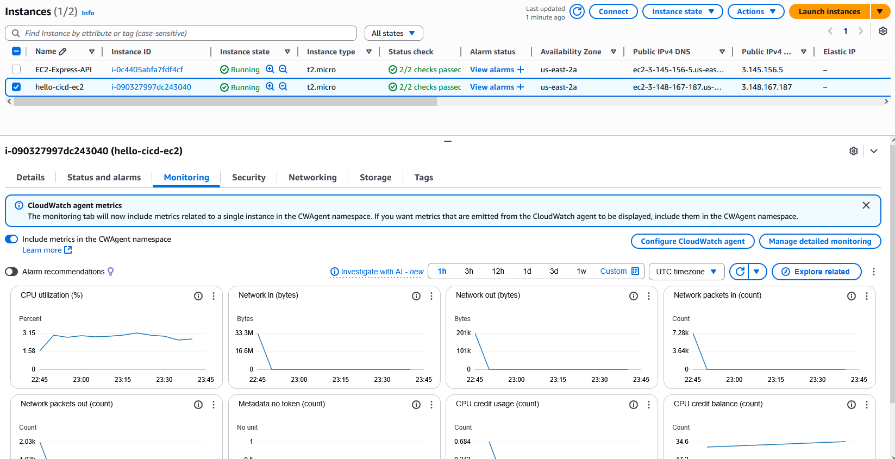
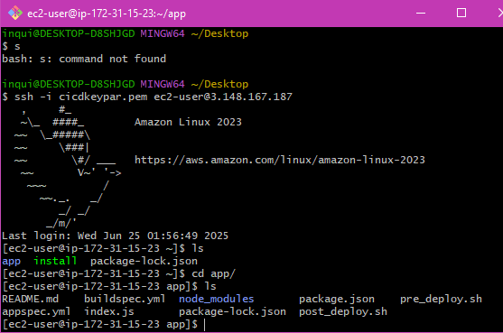
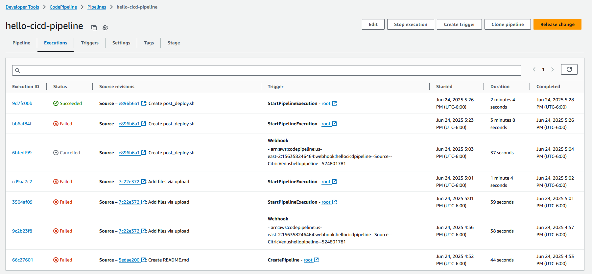
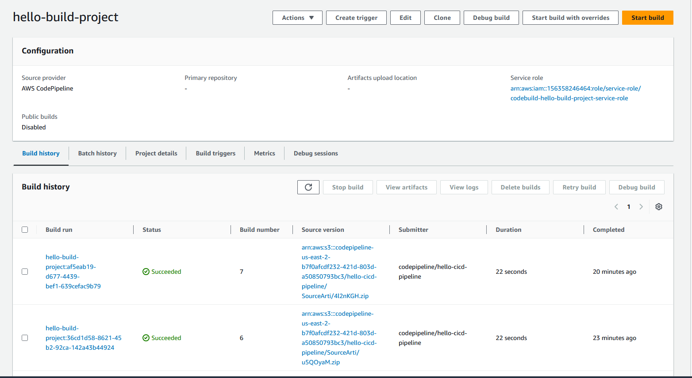
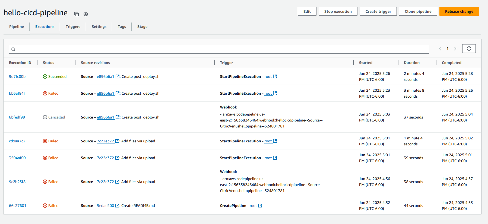
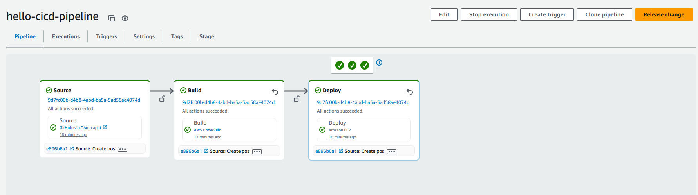
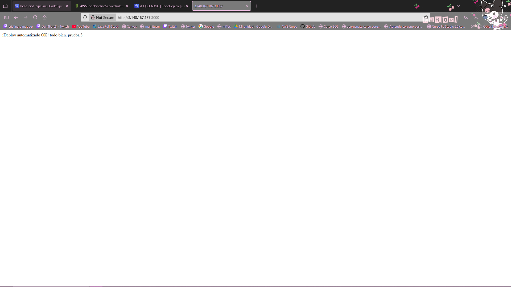
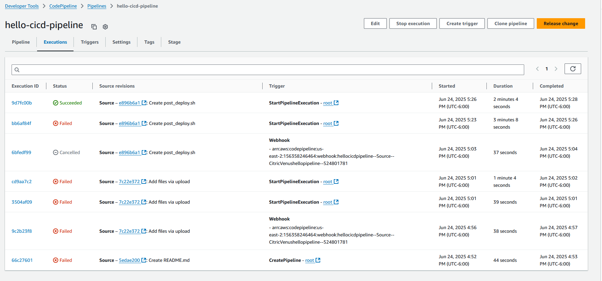

# Proyecto: Pipeline CI/CD con AWS CodePipeline, CodeBuild y CodeDeploy para despliegue automático en EC2

---

## Descripción

Este proyecto configura una pipeline de integración y despliegue continuo (CI/CD) usando servicios de AWS para desplegar automáticamente una aplicación simple en instancias EC2. 

La pipeline está compuesta por:

- **GitHub** como repositorio de código fuente.
- **AWS CodePipeline** para orquestar el flujo completo.
- **AWS CodeBuild** para construir y preparar la aplicación.
- **AWS CodeDeploy** para desplegar el artefacto generado a instancias EC2.

La aplicación es un servidor Express básico que responde en el puerto 3000.

---

## Pasos para configurar el sistema CI/CD

### 1. Crear la aplicación y subir a GitHub

- Aplicación Node.js sencilla en `index.js`.
- Archivo `package.json` con dependencias.
- Archivos `buildspec.yml` y `appspec.yml` en la raíz del repositorio.

### 2. Configurar CodeDeploy

- Crear una aplicación CodeDeploy en la consola AWS (Compute platform: EC2/On-premises).
- Crear un Deployment Group que incluya las instancias EC2 objetivo.
- Asignar el rol de servicio de CodeDeploy con permisos adecuados.

### 3. Configurar CodeBuild

- Crear un proyecto CodeBuild apuntando al repositorio GitHub.
- Usar entorno gestionado con runtime Node.js.
- Incluir el archivo `buildspec.yml` para definir los comandos de instalación y build.

### 4. Configurar CodePipeline

- Crear pipeline en CodePipeline.
- Configurar el Source stage apuntando a GitHub y branch correspondiente.
- Configurar el Build stage apuntando al proyecto CodeBuild.
- Configurar el Deploy stage usando CodeDeploy con la aplicación y deployment group configurados.

### 5. Probar el pipeline

- Realizar cambios en el repositorio (ej. editar README.md).
- Hacer commit y push.
- Verificar que CodePipeline se ejecute automáticamente.
- Revisar que CodeBuild compile y CodeDeploy despliegue en EC2.
- Confirmar que la app esté corriendo en la instancia EC2.

Imagenes:

Instancia  

App

Build

Code Build

Deploy

Pipeline

Prueba app

Source

